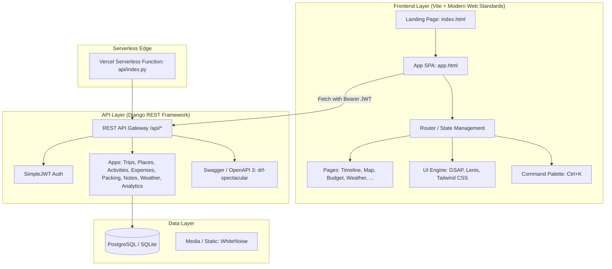

# 🌍 Trip OS — سیستم‌عامل جامع و هوشمند برنامه‌ریزی سفر

<div align="center">


[](https://www.djangoproject.com/)
[](https://www.django-rest-framework.org/)
[](https://vitejs.dev/)
[](https://tailwindcss.com/)
[](https://greensock.com/gsap/)
[](https://www.python.org/)
[](https://www.postgresql.org/)
[](https://vercel.com/)

<br />

**یک پلتفرم مدرن، سریع، بصری و یکپارچه برای طراحی، زمان‌بندی، مدیریت مالی و هماهنگی گروهی سفرهای داخلی و بین‌المللی**

[امکانات کلیدی](#-امکانات-و-قابلیت‌های-پروژه) •
[معماری و تکنولوژی‌ها](#-معماری-سیستم-و-پشته-فناوری) •
[ساختار پوشه‌ها](#-ساختار-پروژه) •
[راه‌اندازی محلی](#-راهنمای-نصب-و-راه‌اندازی-سریع) •
[مستندات API](#-مستندات-api-و-سرویس‌ها) •
[استقرار](#-استقرار-در-محیط-عملیاتی-deployment)

</div>

---

## 📖 معرفی پروژه

**Trip OS** پاسخی یکپارچه به آشفتگی ناشی از پراکندگی ابزارهای سفر است. در حالت سنتی، مسافران برنامه‌ریزی سفر خود را بین چندین فایل اکسل، یادداشت‌های موبایل، نقشه‌های گوگل، چت‌های گروهی و سایت‌های هواشناسی تقسیم می‌کنند. 

**Trip OS** تمامی این نیازها را در قالب یک **سیستم‌عامل سفر (Trip Operating System)** گردهم آورده است:
- یک **لندینگ پیج تعاملی و زیبا** با انیمیشن‌های مینیمال و روان برای معرفی سیستم و نمایش زنده امکانات.
- یک **وب‌اپلیکیشن تک‌صفحه‌ای (SPA)** فوق‌العاده سریع با معماری ماژولار، پالت دستورات هوشمند (`Ctrl + K`)، تایم‌لاین روزانه، نقشه جغرافیایی، تفکیک هزینه‌های چندارزی و مدیریت مشارکتی سفر.

---

## ✨ امکانات و قابلیت‌های پروژه

### 🧭 ۱. مدیریت هوشمند سفرها (Trips Management)
- **چرخه حیات سفر**: دسته‌بندی در وضعیت‌های مختلف اعم از *در حال برنامه‌ریزی (Planning)*، *سفر جاری (Active)*، *تکمیل‌شده (Completed)* و *بایگانی (Archived)*.
- **اطلاعات جامع مقصد**: عنوان سفر، شهر و کشور مقصد، تاریخ شروع و پایان با محاسبه خودکار تعداد روزها، تصویر کاور و توضیحات سفر.
- **همکاری تیمی و اشتراک‌گذاری (Trip Collaboration)**: سیستم تعیین سطوح دسترسی شامل **مالک (Owner)**، **ویرایشگر (Editor)** و **مشاهده‌کننده (Viewer)**.

### 📅 ۲. تایم‌لاین و برنامه‌ریزی روزانه و ساعتی (Interactive Timeline & Itinerary)
- تفکیک خودکار روزهای سفر بر اساس تقویم (`TripDay`).
- ایجاد فعالیت‌ها و برنامه‌های ساعتی (`Activity`) برای هر روز با تعیین زمان شروع، پایان و مدت زمان تخمینی.
- دسته‌بندی موضوعی فعالیت‌ها: گشت‌وگذار (Sightseeing)، رستوران و کافه (Food)، تفریح و ماجراجویی (Adventure)، خرید (Shopping)، فرهنگ و هنر (Culture)، استراحت (Relaxation) و حمل‌ونقل (Transport).
- علامت‌گذاری وضعیت انجام فعالیت‌ها (Completed).

### 📍 ۳. مدیریت اماکن و نقاط دیدنی (Places & POIs)
- ثبت جاذبه‌ها، هتل‌ها، مراکز خرید، کافه‌ها، فرودگاه‌ها و پارک‌ها به همراه اطلاعات دقیق.
- ثبت مختصات جغرافیایی (عرض و طول جغرافیایی / Latitude & Longitude) برای مسیریابی.
- تخمین هزینه ورودی یا استفاده از مکان، مدت زمان پیشنهادی بازدید، تصاویر اختصاصی و آدرس متنی.

### 🗺️ ۴. نقشه تعاملی و ویژوالایزر مسیر (Interactive Map)
- نمایش بصری مکان‌های ثبت‌شده بر روی نقشه.
- مشاهده مسیر تردد و ترتیبی روزها و ایستگاه‌های هر سفر.
- دسترسی سریع به اطلاعات هر نقطه از روی نقشه.

### 💰 ۵. ردیاب و تحلیلگر بودجه و هزینه‌ها (Multi-Currency Budget & Expense Tracker)
- تعیین سقف بودجه اولیه برای هر سفر با پشتیبانی از ارزهای مختلف (ریال، تومان، یورو، دلار و ...).
- ثبت ریز هزینه‌ها بر اساس تاریخ و متصل به روزهای خاص سفر (`Expense`).
- دسته‌بندی دقیق مخارج: اقامت (Accommodation)، غذا و نوشیدنی (Food)، حمل‌ونقل (Transport)، تفریحات (Activities)، خرید (Shopping)، بلیط‌ها (Tickets) و سایر (Other).
- تحلیل بصری و نموداری: درصد مصرف بودجه، باقی‌مانده سقف مالی، سهم هر دسته‌بندی و گزارش میانگین هزینه روزانه.

### 🧳 ۶. چک‌لیست هوشمند چمدان و ملزومات (Smart Packing Checklist)
- سازمان‌دهی ملزومات سفر در دسته‌بندی‌های استاندارد:
  - 👕 پوشاک (Clothing)
  - 📄 اسناد و مدارک (Documents)
  - 🔌 لوازم الکترونیکی (Electronics)
  - 🧴 لوازم شخصی و بهداشتی (Personal)
  - 💊 سلامت و داروها (Health)
  - ✈️ وسایل پرواز و سفر (Travel)
- تعیین تعداد اقلام مورد نیاز، تیک‌زدن موارد بسته‌بندی‌شده و نوار پیشرفت درصد تکمیل چمدان.

### 🌤️ ۷. هواشناسی و پیش‌بینی اقلیمی (Weather Forecast)
- استعلام وضعیت آب‌وهوا بر اساس مقصد سفر و روزهای تقویم.
- نمایش وضعیت جوی، بیشینه و کمینه دما، رطوبت، سرعت باد و هشدارهای شرایط جوی نامساعد.

### 📝 ۸. یادداشت‌ها و مستندات سفر (Notes & Travel Journal)
- ثبت یادداشت‌های آزاد، اطلاعات هتل، بلیت پرواز، خاطرات روزانه یا شماره تماس‌های ضروری.
- امکان الصاق یادداشت به کل سفر، یک روز معین (`TripDay`) یا یک مکان خاص (`Place`).

### 📊 ۹. داشبورد و تحلیل آماری (Analytics & Overview)
- گزارش جامع از تعداد سفرها، روزهای سپری‌شده، نرخ تکمیل چک‌لیست‌ها و وضعیت اهداف سفر.
- نمودارهای آماری تفکیکی توزیع هزینه‌ها و نمودار جریان زمانی سفر.

### 🔍 ۱۰. موتور جستجوی سراسری (Global Search)
- جستجوی بلادرنگ در میان تمامی موجودیت‌های حساب کاربر (سفرها، روزها، فعالیت‌ها، یادداشت‌ها و اماکن).

### 🔔 ۱۱. سیستم اعلانات و یادآورها (Notifications & Alerts)
- ثبت اعلانات سیستمی (مانند عبور هزینه‌ها از ۸۰٪ بودجه، تغییر برنامه‌ها یا یادآورهای سفر).
- فیلتر کردن بر اساس خوانده‌شده/نشده، ثبت تکی مطالعه و علامت‌گذاری یک‌باره همه اعلانات (`mark-all-read`).

### ⚡ ۱۲. پالت دستورات سریع و میانبرها (Command Palette — `Ctrl + K`)
- دسترسی سریع به تمامی صفحات و بخش‌ها بدون نیاز به کلیک‌های متوالی.
- تغییر سفر فعال، ثبت سریع یادداشت یا رفتن به صفحه اختصاصی تنها با جستجو در پالت کیبورد.

### 🎨 ۱۳. طراحی بصری ممتاز، انیمیشن‌ها و پشتیبانی RTL
- طراحی مدرن بر پایه اصول Glassmorphism، تایپوگرافی چشم‌نواز با فونت **وزیرمتن (Vazirmatn)**.
- پیاده‌سازی افکت‌های اسکرول نرم با **Lenis** و انیمیشن‌های ورود و جابجایی عناصر با **GSAP**.
- پشتیبانی کامل از جهت راست‌به‌چپ (RTL) و ارقام فارسی در تاریخ‌ها و مبالغ.

---

## 🏗️ معماری سیستم و پشته فناوری

Trip OS از یک معماری تفکیک‌شده (Decoupled Architecture) با قابلیت اجرا به صورت مستقل یا مستقر روی بسترهای مدرن سرورلس بهره می‌برد.



### پشته فناوری بک‌اند (Backend Stack)
| تکنولوژی | کاربرد |
| :--- | :--- |
| **Python 3.12+** | زبان اصلی توسعه سرور |
| **Django 5.2** | فریم‌ورک قدرتمند وب با ساختار ماژولار و امنیت بالا |
| **Django REST Framework (DRF)** | ساخت وب‌سرویس‌های استاندارد RESTful |
| **SimpleJWT** | احراز هویت با Access Token و Refresh Token چرخشی (Token Rotation & Blacklisting) |
| **drf-spectacular** | تولید خودکار اسناد OpenAPI 3.0 و رابط کاربری Swagger UI |
| **psycopg 3** | درایور مدرن و سریع اتصال به PostgreSQL (سازگار با دیتابیس‌های ابری مثل Neon) |
| **WhiteNoise** | سرو و فشرده‌سازی خودکار دارایی‌های استاتیک در محیط عملیاتی |
| **django-filter & django-cors-headers** | مدیریت فیلترهای پیشرفته و امنیت ارتباط متقاطع دامنه‌ها (CORS) |

### پشته فناوری فرانت‌اند (Frontend Stack)
| تکنولوژی | کاربرد |
| :--- | :--- |
| **Vite 8** | ابزار بیلد، باندلینگ و سرور توسعه با سرعت مافوق صوت (HMR) |
| **Tailwind CSS v4** | فریم‌ورک سی‌اس‌اس کامپوننت‌محور و سبک |
| **GSAP (GreenSock 3.15)** | موتور انیمیشن‌سازی پیچیده، روان و تایم‌لاین‌های حرکتی |
| **Lenis** | کتابخانه اسکرول نرم (Smooth Scrolling) مدرن |
| **Vanilla ES Modules & SPA Router** | ساختار جاوااسکریپت ماژولار، سبک، بدون بار اضافی و مسیریاب مبتنی بر هش |

---

## 📁 ساختار پروژه

```text
alpha-trip/
├── api/                     # هندلر سرورلس Vercel برای اجرای جنگو
│   ├── index.py             # پل ارتباطی WSGI به توابع سرورلس ورسل
│   └── requirements.txt     # وابستگی‌های محیط استقرار سرورلس
├── backend/                 # هسته اصلی سرور جنگو
│   ├── apps/                # ماژول‌های مستقل سامانه (Django Apps)
│   │   ├── activities/      # فعالیت‌های روزانه و برنامه‌های ساعتی
│   │   ├── analytics/       # محاسبات تحلیلی و آمار سفر
│   │   ├── destinations/    # فهرست مقاصد پیشنهادی و متادیتا
│   │   ├── expenses/        # بودجه و هزینه‌های سفر
│   │   ├── notes/           # یادداشت‌ها و مستندات سفر
│   │   ├── notifications/   # اعلانات و هشدارهای سیستمی
│   │   ├── packing/         # چک‌لیست بسته‌بندی چمدان
│   │   ├── places/          # اماکن و نقاط دیدنی روی نقشه
│   │   ├── search/          # جستجوی فراگیر در اطلاعات
│   │   ├── trips/           # مدیریت سفرها، روزها و اعضا
│   │   │   └── management/commands/seed_demo.py  # کامند تولید داده‌های دمو
│   │   ├── users/           # احراز هویت، پروفایل و توکن‌های JWT
│   │   └── weather/         # سرویس و اطلاعات هواشناسی
│   ├── common/              # مدل‌ها، پیجینیشن و کلاس‌های اشتراکی
│   ├── config/              # پیکربندی کلی پروژه جنگو
│   │   ├── settings/        # تفکیک تنظیمات (base, development, production)
│   │   ├── urls.py          # روت‌های اصلی وب‌سرویس و Swagger
│   │   ├── wsgi.py & asgi.py
│   ├── requirements.txt     # پکیج‌های پایتونی بک‌اند
│   └── manage.py
├── front/                   # پروژه فرانت‌اند
│   ├── index.html           # صفحه معرفی، لندینگ پیج و پیش‌نمایش
│   ├── app.html             # پوسته اصلی وب‌اپلیکیشن (SPA Application Shell)
│   ├── package.json         # وابستگی‌ها و اسکریپت‌های npm
│   ├── vite.config.js       # تنظیمات بیلد چندصفحه‌ای Vite
│   ├── scripts/             # اسکریپت‌های تست یکپارچگی و سلامت کدهای فرانت
│   └── src/
│       ├── css/             # استایل‌های ماژولار، کامپوننت‌ها و انیمیشن‌ها
│       └── js/
│           ├── animations/  # منطق انیمیشن‌های GSAP و اسکرول Lenis
│           ├── components/  # پالت دستورات، مودال‌ها، تولتیپ‌ها و توست‌ها
│           ├── pages/       # صفحات ماژولار SPA (dashboard, timeline, budget, ...)
│           ├── services/    # لایه ارتباط با وب‌سرویس‌های بک‌اند (API Clients)
│           ├── shell/       # نوار ناوبری، سایدبار و نوار بالا
│           ├── state/       # مدیریت وضعیت مشترک کلاینت
│           └── utils/       # هلپرها، فرمت‌کننده‌ها و مبدل‌های تاریخ
├── vercel.json              # پیکربندی استقرار یکپارچه روی بستر Vercel
└── README.md                # مستندات جامع پروژه
```

---

## 🚀 راهنمای نصب و راه‌اندازی سریع

### ۱. پیش‌نیازها
مطمئن شوید موارد زیر روی سیستم شما نصب باشند:
- **Python 3.12+**
- **Node.js 18+** و **npm**
- **Git**

---

### ۲. راه‌اندازی بک‌اند (Backend Setup)

۱. وارد پوشه بک‌اند شوید و یک محیط مجازی پایتون (Virtual Environment) بسازید:
```bash
cd backend
python -m venv venv
```

۲. محیط مجازی را فعال کنید:
- **در ویندوز (PowerShell):**
  ```powershell
  .\venv\Scripts\Activate.ps1
  ```
- **در لینوکس / مک:**
  ```bash
  source venv/bin/activate
  ```

۳. وابستگی‌های پایتون را نصب کنید:
```bash
pip install -r requirements.txt
```

۴. فایل تنظیمات متغیرهای محیطی را ایجاد کنید:
```bash
cp .env.example .env
```
*(به صورت پیش‌فرض، اگر متغیرهای دیتابیس پستگرس پر نشوند، سیستم به صورت خودکار از دیتابیس محلی SQLite استفاده می‌کند و بدون هیچ مشکلی بالا می‌آید)*

۵. مایگریشن‌های پایگاه‌داده را اعمال کنید:
```bash
python manage.py migrate
```

۶. **تزریق اطلاعات نمونه و آماده (داده‌های دمو)**:
پروژه مجهز به یک کامند اختصاصی است که یک کاربر تست با سه سفر کامل (استانبول، شیراز و کیش) همراه با کلیه برنامه‌ها، اماکن، هزینه‌ها، چک‌لیست‌ها و پیش‌بینی هوا تولید می‌کند:
```bash
python manage.py seed_demo
```

> [!TIP]
> **اطلاعات حساب کاربری تست و دمو:**
> - **ایمیل:** `demo@tripos.dev`
> - **رمز عبور:** `Demo-Passw0rd!123`

۷. سرور توسعه جنگو را اجرا کنید:
```bash
python manage.py runserver
```
اکنون وب‌سرویس در آدرس `http://127.0.0.1:8000` در دسترس است.

---

### ۳. راه‌اندازی فرانت‌اند (Frontend Setup)

۱. در یک ترمینال جداگانه، وارد پوشه فرانت شوید:
```bash
cd front
```

۲. وابستگی‌های جاوااسکریپتی را نصب کنید:
```bash
npm install
```

۳. فایل متغیر محیطی را ایجاد کنید:
```bash
cp .env.example .env
```
*(برای محیط توسعه لوکال، مقدار پیش‌فرض `VITE_API_URL` خالی است که به طور خودکار به همان سرور یا آدرس محلی متصل می‌شود؛ در صورت نیاز می‌توانید آن را به `http://127.0.0.1:8000/api` تنظیم نمایید)*

۴. سرور توسعه Vite را روشن کنید:
```bash
npm run dev
```

۵. مرورگر را باز کرده و به آدرس نمایش‌داده‌شده (معمولاً `http://localhost:5173`) بروید:
- **صفحه معرفی و لندینگ:** `http://localhost:5173/`
- **ورود مستقیم به وب‌اپلیکیشن:** `http://localhost:5173/app.html`

---

## 📡 مستندات API و سرویس‌ها

پروژه از سیستم استاندارد مستندسازی OpenAPI 3 استفاده می‌کند. پس از اجرای بک‌اند، می‌توانید به صورت تعاملی تمام اندپوینت‌ها را در Swagger تست کنید:

- **مستندات تعاملی Swagger:** [http://127.0.0.1:8000/api/docs/](http://127.0.0.1:8000/api/docs/)
- **اسکیمای خام OpenAPI JSON:** [http://127.0.0.1:8000/api/schema/](http://127.0.0.1:8000/api/schema/)

### خلاصه‌ای از مهم‌ترین اندپوینت‌ها:

| ماژول | متد | اندپوینت | توضیحات |
| :--- | :---: | :--- | :--- |
| **سلامت سرور** | `GET` | `/api/health/` | وضعیت سلامت و آمادگی سرویس |
| **احراز هویت** | `POST` | `/api/auth/register/` | ثبت‌نام کاربر جدید |
| **احراز هویت** | `POST` | `/api/auth/login/` | ورود و دریافت جفت‌توکن JWT (Access & Refresh) |
| **احراز هویت** | `POST` | `/api/auth/refresh/` | تمدید Access Token منقضی‌شده |
| **احراز هویت** | `POST` | `/api/auth/logout/` | ابطال و بلک‌لیست کردن Refresh Token |
| **پروفایل** | `GET / PATCH` | `/api/users/me/` | دریافت و ویرایش مشخصات و تنظیمات کاربر |
| **پروفایل** | `POST` | `/api/users/me/avatar/` | آپلود تصویر آواتار |
| **داشبورد** | `GET` | `/api/dashboard/` | خلاصه آماری سفرهای فعال و آخرین رویدادها |
| **سفرها** | `GET / POST` | `/api/trips/` | دریافت لیست سفرها یا ایجاد سفر جدید |
| **جزئیات سفر** | `GET / PUT / DELETE` | `/api/trips/{id}/` | مشاهده، ویرایش یا حذف یک سفر |
| **اماکن** | `GET / POST` | `/api/trips/{trip_id}/places/` | اماکن و جاذبه‌های ثبت‌شده برای یک سفر |
| **فعالیت‌ها** | `GET / POST` | `/api/trips/{trip_id}/activities/` | برنامه‌ها و تایم‌لاین ساعتی سفر |
| **هزینه‌ها** | `GET / POST` | `/api/trips/{trip_id}/expenses/` | ثبت و دریافت ریز هزینه‌های سفر |
| **چک‌لیست چمدان** | `GET / POST` | `/api/trips/{trip_id}/packing/` | لیست لوازم بسته‌بندی برای سفر |
| **پیشرفت چمدان** | `GET` | `/api/trips/{trip_id}/packing/progress/` | آمار و درصد اقلام جمع‌آوری‌شده |
| **یادداشت‌ها** | `GET / POST` | `/api/trips/{trip_id}/notes/` | یادداشت‌های متصل به سفر یا روزها |
| **هواشناسی** | `GET` | `/api/trips/{trip_id}/weather/` | پیش‌بینی آب‌وهوای مقصد در طول مدت سفر |
| **آمار سفر** | `GET` | `/api/trips/{trip_id}/analytics/` | تحلیل پیشرفته مالی و زمانی سفر |
| **اعلانات** | `GET` | `/api/notifications/` | دریافت لیست هشدارهای کاربر |
| **علامت‌گذاری اعلان**| `POST` | `/api/notifications/read-all/` | خوانده شدن همه اعلانات |
| **جستجوی فراگیر** | `GET` | `/api/search/?q={query}` | جستجو در تمامی داده‌ها با کلیدواژه |
| **مقاصد پیشنهادی**| `GET` | `/api/destinations/` | بانک اطلاعات مقاصد گردشگری جهت پیشنهاد |

---

## ⌨️ کلیدهای میانبر (Keyboard Shortcuts)

برای تجربه کاربری سریع و مشابه دسکتاپ، کلیدهای زیر در محیط وب‌اپلیکیشن در دسترس هستند:

- **`Ctrl + K` یا `Cmd + K`**: باز کردن سریع **Command Palette** برای جستجو، تغییر مسیر بین صفحات و جابجایی بین سفرهای فعال.
- **`Esc`**: بستن پنجره‌های مودال، پالت دستورات یا منوهای باز.
- **کلیدهای جهت‌نما (`↑` / `↓`) + `Enter`**: ناوبری کیبوردی سریع داخل نتایج جستجوی دستورات.

---

## 🧪 تست و اعتبارسنجی کیفیت (Testing)

### تست‌های بک‌اند
مجموعه تست‌های واحد و یکپارچگی با استفاده از تست‌رانر جنگو قابل اجرا هستند:
```bash
cd backend
python manage.py test
```

### تست‌های خودکار فرانت‌اند
اسکریپت‌های بررسی ماژول‌ها و صحت توابع ریاضی و تقویم جلالی:
```bash
cd front
node scripts/smoke-imports.mjs
node scripts/test-jalali.mjs
```

---

## ☁️ استقرار در محیط عملیاتی (Deployment)

پروژه به صورت کامل برای استقرار روی پلتفرم ابری **Vercel** به صورت **Serverless Full-Stack** آماده‌سازی شده است:
- فایل [`vercel.json`](./vercel.json) کلیه درخواست‌های `/api/*` را به فانکشن سرورلس پایتون در [`api/index.py`](./api/index.py) هدایت می‌کند.
- بخش فرانت‌اند به صورت استاتیک بیلد شده و از طریق CDN فوق‌سریع Vercel سرو می‌گردد.
- برای پایگاه داده در محیط عملیاتی، می‌توانید از ارائه‌دهندگان ابری دیتابیس PostgreSQL نظیر **Neon**, **Supabase** یا **Railway** استفاده کنید.

### مراحل استقرار روی Vercel:
۱. کد را در ریپازیتوری گیت‌هاب خود Push کنید.  
۲. در پنل Vercel پروژه جدید ایجاد کرده و ریپازیتوری را متصل کنید.  
۳. متغیرهای محیطی زیر را در بخش **Settings > Environment Variables** تعریف کنید:
   - `SECRET_KEY` (یک رشته رندوم امن)
   - `DEBUG=False`
   - `DB_NAME`, `DB_USER`, `DB_PASSWORD`, `DB_HOST`, `DB_PORT` (مشخصات اتصال PostgreSQL)
   - `ALLOWED_HOSTS` (دامنه سایت شما در ورسل)
   - `CORS_ALLOWED_ORIGINS` و `CSRF_TRUSTED_ORIGINS`
۴. دکمه **Deploy** را بزنید! بیلد فرانت و بک‌اند به صورت خودکار انجام خواهد شد.

---

## 🤝 مشارکت در توسعه (Contributing)

مشارکت در توسعه Trip OS بسیار استقبال می‌شود! اگر ایده‌ای برای بهبود، فیچر جدید یا رفع باگ دارید:
۱. پروژه را **Fork** کنید.  
۲. یک برنچ جدید برای ویژگی خود بسازید (`git checkout -b feature/AmazingFeature`).  
۳. تغییرات را کامیت کنید (`git commit -m 'feat: Add an awesome travel widget'`).  
۴. برنچ را پوش کنید (`git push origin feature/AmazingFeature`).  
۵. یک **Pull Request** ارسال کنید.

---

<div align="center">

ساخته‌شده با ❤️ برای علاقه‌مندان به سفر و کاوش جهان

</div>
